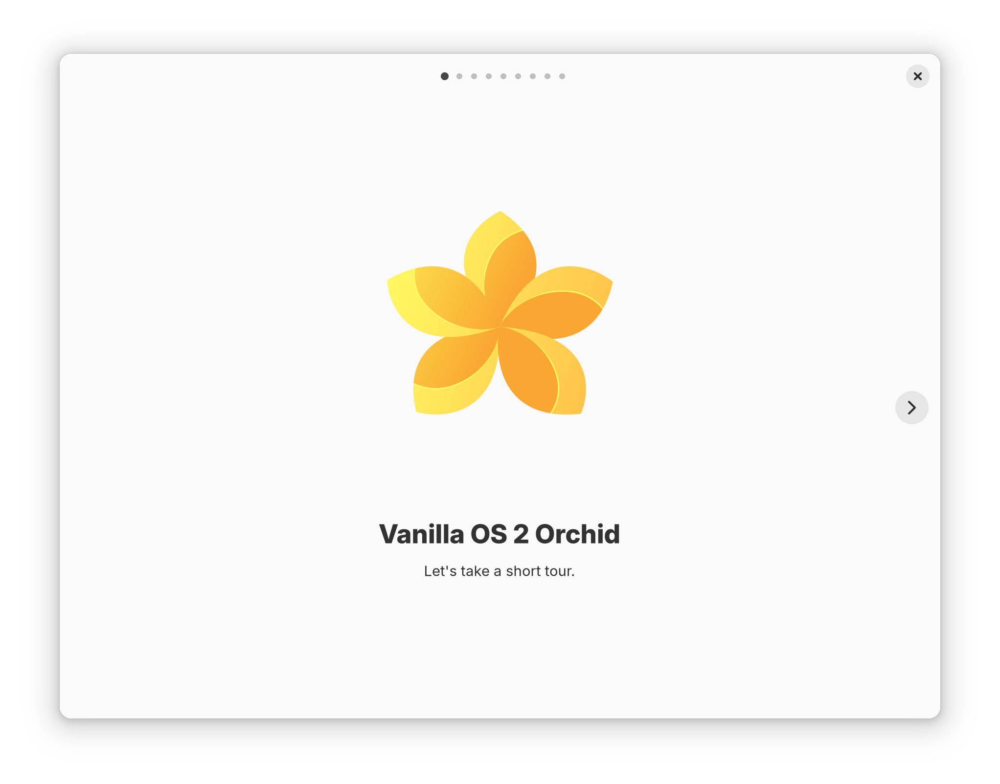

<div align="center">
    
    <h1>Vanilla OS Tour</h1>
    <p>A quick slideview Tour of all new things in Vanilla OS.</p>
    <hr />
    <br />
    
</div>

## Build

### Dependencies

- build-essential
- meson
- libadwaita-1-dev
- gettext
- desktop-file-utils
- blueprint-compiler

```bash
meson build
ninja -C build
```

### Install

```bash
sudo ninja -C build install
```

## Run

```bash
vanilla-tour
```
